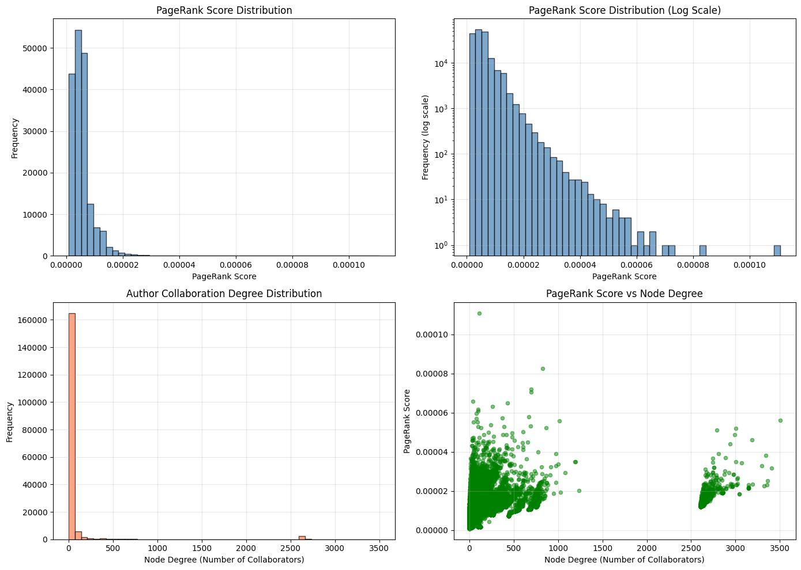
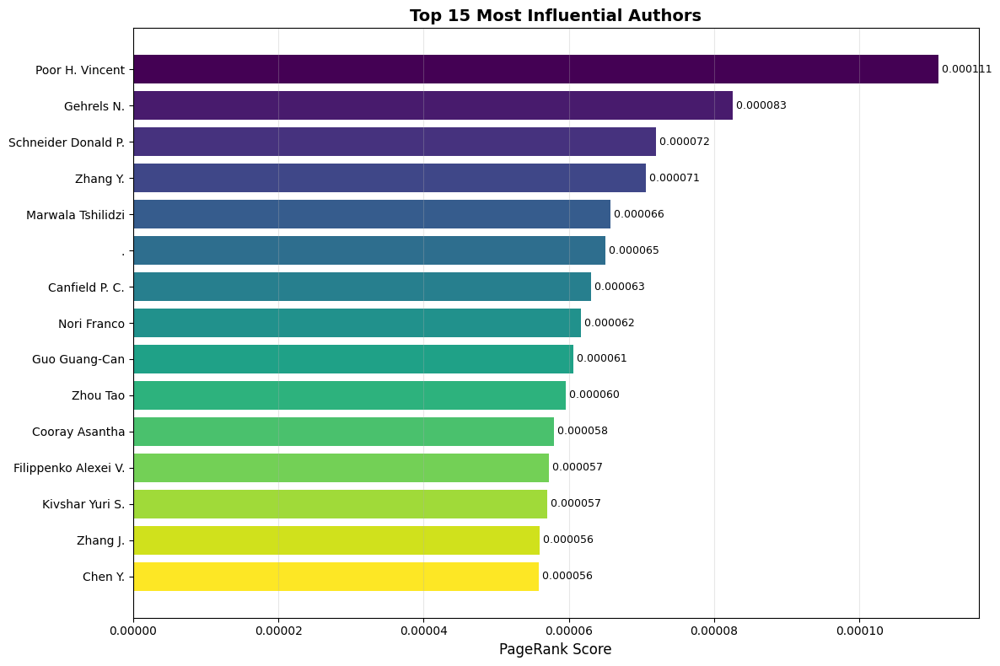
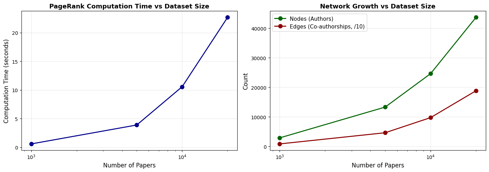

# Algorithms-for-Massive-Data-Analysis

# Link Analysis: PageRank for arXiv Co-authorship Network 📄


A large-scale graph analysis project implemented from scratch using **Python and NetworkX**.

This project implements the **PageRank algorithm** to identify the most influential researchers in the arXiv co-authorship network. By modelling authors as nodes and co-authorship as edges, the algorithm ranks researchers by their structural importance in the scientific community.

---

## 🚀 Key Highlights
* **Scale:** Processed a graph of **177,795 authors** and **5,322,132 co-authorship links** from 150,000 papers.
* **Performance:** Custom iterative PageRank converged in **60 iterations** on Google Colab.
* **Engineering:** Implemented a **streaming data loader** to handle the 5GB arXiv JSONL file within 12GB RAM constraints.
* **Algorithm:** Custom implementation of **PageRank** validated against NetworkX's built-in `nx.pagerank()`.

---

## 📊 The Dataset
**Source:** [arXiv Dataset (Kaggle)](https://www.kaggle.com/datasets/Cornell-University/arxiv)
* **Raw Size:** ~5,093 MB (2M+ paper records).
* **Preprocessing Pipeline:**
    1. **Streaming Load:** Dataset read line-by-line to avoid loading the full 5GB file into memory.
    2. **Author Extraction:** Structured author names parsed from `authors_parsed` field (`[firstname, lastname, affiliation]`).
    3. **Filtering:** Papers with missing or empty author lists discarded (100% retention on sampled data).
    4. **Edge Deduplication:** Raw co-authorship pairs (7,189,877) aggregated into weighted unique edges (5,322,132).
    5. **Sampling:** Configurable via `SAMPLE_SIZE = 150000`; full dataset mode available via `USE_FULL_DATA = True`.

---

## 🧠 Methodology

### 1. Graph Construction
We modelled the data as a **Co-authorship Graph**:
* **Nodes:** Authors.
* **Edges:** Undirected weighted link between any two authors who co-authored at least one paper.
* **Weight:** Number of papers co-authored together.

### 2. Algorithm

The PageRank score $r(v)$ for each author $v$ is computed iteratively:

$$r^{(t+1)}(v) = \frac{1-\beta}{N} + \beta \sum_{u \in \mathcal{N}(v)} \frac{r^{(t)}(u)}{\deg(u)}$$

| Parameter | Value |
| :--- | :--- |
| Damping factor $\beta$ | 0.85 |
| Convergence tolerance $\epsilon$ | $10^{-6}$ |
| Max iterations | 100 |
| Converged at iteration | **60** |

Results validated against NetworkX's `nx.pagerank()` — score differences consistently below $10^{-5}$.

---

## 📈 Results & Visuals

### 1. Top Authors
| Rank | Author | PageRank Score | Collaborators |
| :--- | :--- | :--- | :--- |
| 1 | Poor H. Vincent | 0.000111 | 116 |
| 2 | Gehrels N. | 0.000083 | 830 |
| 3 | Schneider Donald P. | 0.000072 | 697 |
| 4 | Zhang Y. | 0.000071 | 699 |
| 5 | Marwala Tshilidzi | 0.000066 | 39 |

### 2. PageRank vs Degree
The top-ranked author (H. Vincent Poor, 116 collaborators) outranks authors with thousands of collaborators (e.g. Zhang J., 3,504 collaborators) — demonstrating that **PageRank captures influence beyond raw connectivity**.

### 3. Convergence
The $\ell_1$ difference between successive score vectors decreased monotonically from $6.14 \times 10^{-3}$ at iteration 10 to $8.70 \times 10^{-7}$ at iteration 60.




---

## ⚙️ Scalability

The solution scales linearly with data size:

| Papers | Authors | Edges | Time (s) |
| :--- | :--- | :--- | :--- |
| 1,000 | 2,870 | 8,251 | 0.58 |
| 5,000 | 13,300 | 46,059 | 3.88 |
| 10,000 | 24,626 | 97,362 | 10.56 |
| 20,000 | 43,711 | 188,393 | 22.67 |



---

## 🛠️ Installation & Usage

### Prerequisites
* Google Colab (Recommended).
* Kaggle Account (for API credentials).

### Running the Project
1. Clone this repository or open the notebook directly in Google Colab via the badge above.
2. **Set up Kaggle credentials:**
    * Go to [kaggle.com/settings](https://www.kaggle.com/settings/account) → API → **Create New Token** → download `kaggle.json`.
    * Upload `kaggle.json` when prompted by the notebook.
3. Run all cells top to bottom. The dataset (~5GB) downloads automatically.

```bash
# Data download is handled automatically inside the notebook
!kaggle datasets download -d Cornell-University/arxiv -p /tmp/arxiv_data --unzip
```

### Controlling Data Volume
Two global variables in the notebook control data size:

```python
USE_FULL_DATA = False   # Set True for full 2M+ paper dataset (requires 16GB+ RAM)
SAMPLE_SIZE   = 150000  # Papers to load when USE_FULL_DATA = False
```

---

## 📁 Repository Structure

```
📦 Algorithms-for-Massive-Data-Analysis
 ┣ 📓 PageRank_Project.ipynb   ← Main notebook (Google Colab ready)
 ┣ 📄 report.pdf               ← Project report
 ┣ 🖼️ fig_distribution.png    ← PageRank score & degree distributions
 ┣ 🖼️ fig_top_authors.png     ← Top 15 authors bar chart
 ┣ 🖼️ fig_scalability.png     ← Scalability benchmark plots
 ┗ 📄 README.md
```
